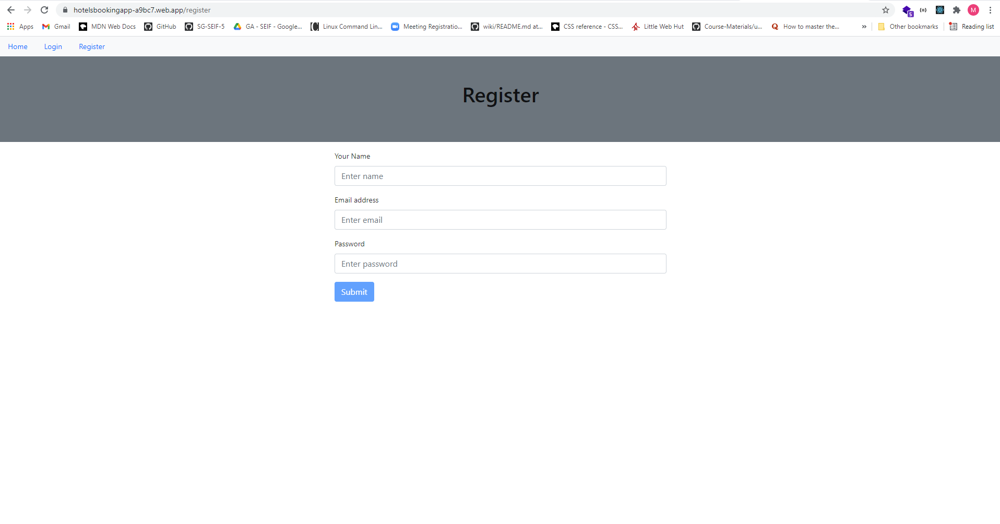
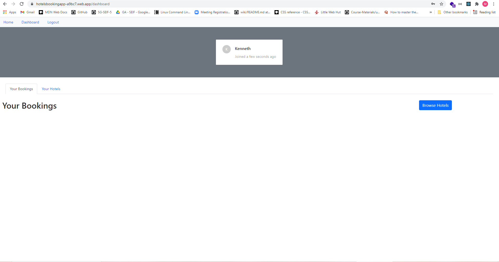
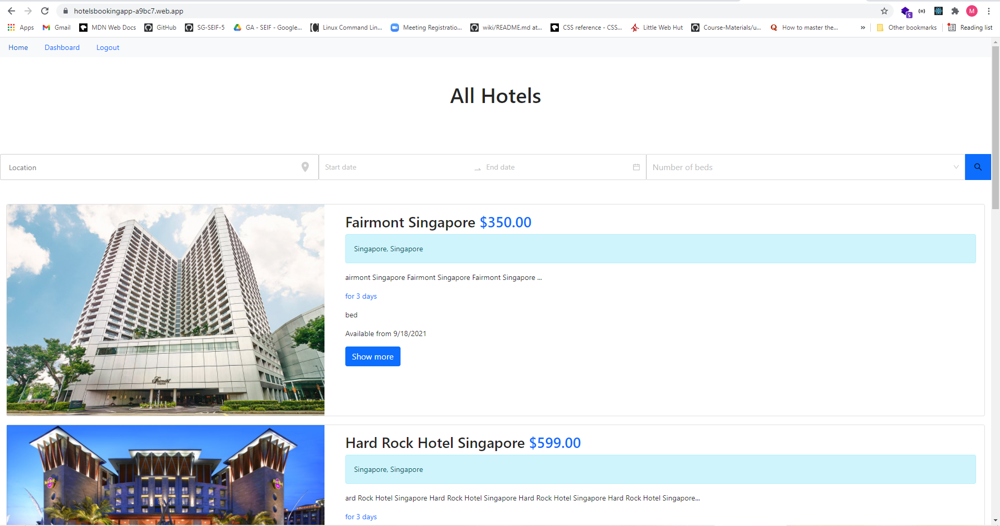
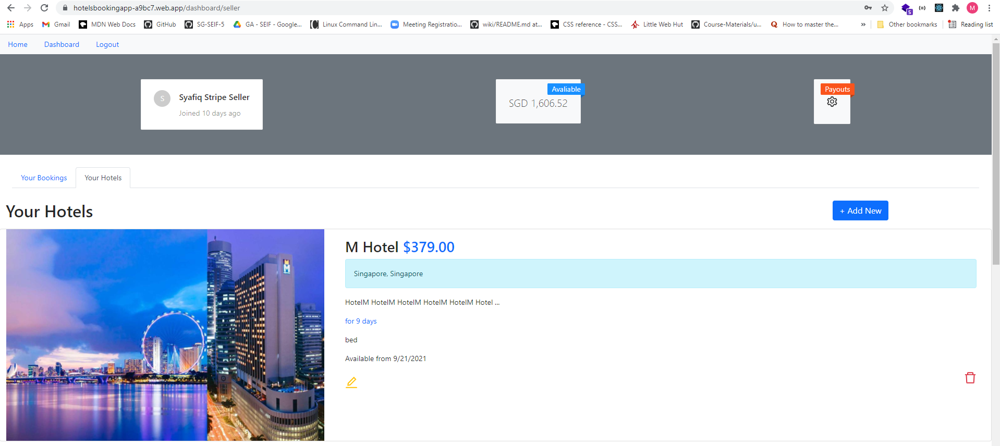

<h1 align="center">Hotel Booking Platform</h1>

An online application for seller to post their hotel listings, while buyers can browse through the listings and make bookings

## Links

- [Repo - Frontend](https://github.com/syafiqsaleem/hotelbookingapp-fe)

- [Repo - Backend](https://github.com/syafiqsaleem/hotelbookingapp-be)

- [App - Firebase](https://hotelsbookingapp-a9bc7.web.app)

## Screenshots

### Registration Page

### Dashboard (Buyer)

### Hotel Listing (Buyer)

### Dashboard (Seller)

### Stripe Payout (Seller)

.png>)

## Instructions

1. Register and create an account.
2. Register via Stripe (Your Hotels -> Setup Payouts) to be a seller
3. Login upon completion on registering.
4. (User) Browse through the lisitngs and book hotel.
5. (Seller) Able to post hotel listings

## Available Routes

In the project directory, you can access:

### `User (Non registered/Not logged in)`

- View available hotels
- Search for hotels in the listing via location, date, and number of beds
- Find out more details about listed hotels

### `User (Signed in)`

- View available hotels
- Search for hotels in the listing via location, date, and number of beds
- Find out more details about listed hotels
- Make hotel bookings/reservation
- View your bookings/reservations at the dashboard page

### `Seller`

- Register via Stripe to be a seller (Be able to list their hotels)
- Dashboard (Available) -> View amount of money made from sales (total)
- Dashboard (Payouts) -> Money will automatically be transferred to seller every 7 days, sellers can check the details here.
- Dashboard (Your Hotels) -> View, edit and delete the hotels listed by the logged in seller
- Dashboard (+ Add New) -> Create new hotel listings

## MVP

Features:

1. Search function (Search via location, dates, and number of beds)
2. Make payment via Stripe
3. Auto payout to seller every 7 days
4. Once a user books a hotel listed, 80% goes to the seller, and 20% goes to the app
5. Register Sellers via Stripe

## Built With

- Mongodb
- Express
- React
- Redux
- Node
- Express
- Mongoose
- Formidable (handle form data)
- Moment (date handling)
- Stripe (payment)
- Bootstrap
- JSON web token
- Ant Design
- Algolia API
- Axios

## Future Updates

- [ ] To separate access between buyer and seller
- [ ] Listings not to disappear once user booked, even if the seller removes the listing after.
- [ ] Other payment options (e.g. via google/apple pay)
- [ ] More filtering options
- [ ] Standardize image size displayed
- [ ] Improve UI for hotel browsing

## Author

**Mohamed Syafiq**

- [Profile](https://github.com/syafiqsaleem)

## 🤝 Support

Contributions, issues, and feature requests are welcome!

Give a ⭐️ if you like this project!
